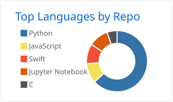
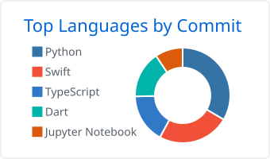
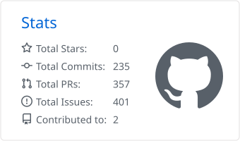
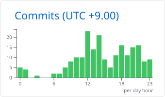

# Tama

**統計モデリングからアプリのリリースまで、一気通貫でつくる。**

日本の EC 企業でデータ / ML エンジニアをしています。統計手法の設計、パイプラインの構築、API 化、その上に乗るアプリの実装まで、一連の流れを自分で手がけています。

- 📊 **生存解析と因果推論** — 傾向スコアマッチング、Kaplan–Meier、Cox 比例ハザード
- 🤖 **LLM アプリケーション** — RAG システム、エージェントパイプライン、ベクトル検索
- 🛠️ **自動化** — 手作業の繰り返しを、放っておいても回るパイプラインに変える
- ✍️ つくったものについて [subbrain-works.net](https://subbrain-works.net/) で書いています

---

## 技術スタック

**言語**

**データ & ML**

**LLM & 検索**

**クラウド & インフラ**

**開発ツール**

---

## 主なプロジェクト

> 以下の多くはプライベートリポジトリです（臨床データおよび未公開プロダクトのため）。
> 設計やコードについては、お話しする場で詳しくご説明できます。

### 🏥 生存解析パイプライン &nbsp;`private`

医療領域の研究協業のために構築した、臨床データを対象とする time-to-event 解析の再現可能なパイプライン。

- **傾向スコアマッチング**による交絡調整と、バランス診断
- **Kaplan–Meier** 生存曲線と **Cox 比例ハザード**モデリング
- 再利用可能な `src/` ライブラリとしてパッケージ化（前処理 / マッチング / 生存解析 / 評価 / 可視化）し、生データからすべての結果を再現できる構成に

`Python` `lifelines` `scikit-survival` `statsmodels` `pandas`

### 🔍 Stera — Structured-text Extraction & Retrieval Assistant &nbsp;`private`

WordPress サイトを RAG ベースのチャット体験に変えるマルチテナント SaaS。サイト運営者が WordPress 管理画面から対象ページを選ぶと、非同期パイプラインがクロール・埋め込み生成・インデックス登録を行い、ショートコードで公開サイトにチャットウィジェットを設置できます。

- 検索基盤に **Firestore Vector Store** を採用 — 固定費ほぼゼロ、リアルタイム更新、GCP ネイティブ統合
- テナントごとの API キー認証を備えた **Cloud Run 上の FastAPI** バックエンド
- RAG パラメータ調整・ナレッジ管理・回答プレビューを行う **React + TypeScript + Vite + Tailwind** の管理コンソール
- Firestore Emulator でローカル完結の再現環境を用意し、GitHub Actions で CI を実行

`FastAPI` `GCP` `Firestore` `React` `TypeScript` `PHP`

### 🎧 TM Beat Studio &nbsp;`private`

長尺の Lo-Fi 音楽動画を生成し、人手を介さず YouTube へ公開するエンドツーエンドのパイプライン。デモではなく実際に運用しているシステムです。

- **拡散モデル**による音声生成と、長時間トラックへの結合
- **MoviePy** / FFmpeg による動画合成とレンダリング
- **YouTube Data API** を用いたアップロード・メタデータ付与・公開スケジューリングの自動化

`Python` `diffusers` `MoviePy` `YouTube Data API`

### 📱 iOS アプリ & 開発テンプレート &nbsp;`private`

- **Life is Quest** — 目標を RPG のクエストに見立てるゲーミフィケーションタスク管理アプリ。レトロゲーム風 UI（`Swift` / `SwiftUI`）
- **AWS CLF Exam App** — LLM で類似問題を生成する資格学習アプリ。Firestore ベースの Python サービスと学習進捗の統計分析つき（`Swift` / `Python` / `Firestore` / `OpenAI API`）
- **Python Analysis Template** — 分析プロジェクトの出発点となるテンプレート。`uv` + src レイアウト + `Ruff` + `mypy` + `pytest` で、初日から再現性のある状態をつくる

---

## Activity

言語・コミット統計にはプライベートリポジトリを含みます（リポジトリ名やコミット内容は公開されません）。

<picture>
  <source media="(prefers-color-scheme: dark)" srcset="./profile-summary-card-output/github_dark/1-repos-per-language.svg">
  
</picture>
<picture>
  <source media="(prefers-color-scheme: dark)" srcset="./profile-summary-card-output/github_dark/2-most-commit-language.svg">
  
</picture>
<picture>
  <source media="(prefers-color-scheme: dark)" srcset="./profile-summary-card-output/github_dark/3-stats.svg">
  
</picture>
<picture>
  <source media="(prefers-color-scheme: dark)" srcset="./profile-summary-card-output/github_dark/4-productive-time.svg">
  
</picture>

---

## 執筆

データ分析・LLM アプリケーション・自動化についての記事を
**[subbrain-works.net](https://subbrain-works.net/)** で公開しています。上記プロジェクトを進める中でぶつかった問題の記録が中心です。

---

## 連絡先

